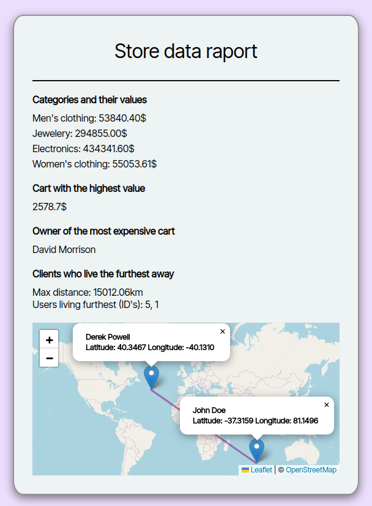

<h2><a href="https://kawalae.github.io/Online-store-data-manipulation/">Click here to view!</a></h2>

<h2>Project description</h2>

This application processes fake online store data from provided URL addresses.
It performs following tasks:
<ol>
    <li>Retrieves data about the user, the product, and the shopping cart.</li>
    <li>Generates a Map data structure with all categories and their total value.</li>
    <li>Determines who has the most valuable shopping cart and it's value.</li>
    <li>Locates two users who live the farthest apart.</li>
</ol> 

    

<h2>Technologies used <h2>

<h2>Acknowledgements:</h2>
<ul>
    <li><a href="https://community.powerbi.com/t5/Desktop/How-to-calculate-lat-long-distance/td-p/1488227">Equation for calculating distance</a></li>
    <li><a href="https://www.seanmcp.com/articles/await-multiple-promises-in-javascript/">Await multiple promises in JS article</a></li>
    <li><a href="https://gis.stackexchange.com/questions/29833/drawing-polyline-in-leaflet">How to add a line in leaflet</a></li>
    <li><a target="_blank" href="https://icons8.com/icon/44050/shopping-cart">Shopping Cart</a> icon by <a target="_blank" href="https://icons8.com">Icons8</a></li>
    <li><a href="https://leafletjs.com/examples/quick-start/">Open source Maps - Leaflet</a></li>
    <li><a href="https://icons8.com/icon/21278/css3">CSS3</a> icon by <a target="_blank" href="https://icons8.com">Icons8</a></li>
    <li><a target="_blank" href="https://icons8.com/icon/PXTY4q2Sq2lG/javascript">JavaScript</a> icon by <a target="_blank" href="https://icons8.com">Icons8</a></li>
    <li><a target="_blank" href="https://icons8.com/icon/v8RpPQUwv0N8/html-5">Html 5</a> icon by <a target="_blank" href="https://icons8.com">Icons8</a></li>
</ul>
